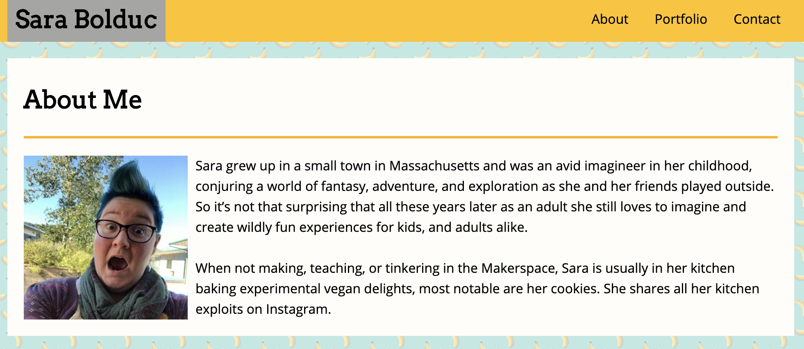

# Responsive-Portfolio
Updated version of my basic portfolio, no bootstrap, that is responsive using viewport tag & @media screen tag

## Built With
* html
* css

## Versioning & Author
This is the only version and is maintained by me, [sabomade](https://github.com/sabomade).

## Acknowledgements
Built & completed as part of the UCB Coding Bootcamp, Homework 2: Responsiveness

